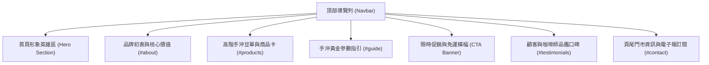

# 網站詳細規格書 (Website Detailed Specification)

> **專案名稱**：綠天咖啡 Green Day Coffee 官方形象與購物網站  
> **版本**：v1.0 (依據 `outline/index.html` 逆向工程產出)  
> **文件代號**：`WebSpec_11515118/specs/detail.md`  
> **撰寫日期**：2026-10-01  

---

## 1. 網站總覽與品牌定義 (Brand & Overview)

### 1.1 基本資料
- **網站名稱**：綠天咖啡 (Green Day Coffee)
- **品牌定位**：專注於頂級莊園單品、微批次的高階手沖精品咖啡品牌
- **主要用途**：推廣專業手沖咖啡工藝與文化，並提供線上精品咖啡豆購買管道
- **目標受眾 (Target Audience)**：
  - 手沖咖啡愛好者與進階玩家
  - 重視產地風土、杯測風味與新鮮烘焙質感的精品咖啡鑑賞家
  - 尋找高品質咖啡禮盒或日常儀式感的現代品味人士

### 1.2 視覺與品牌設計規範 (Design System)
- **品牌風格**：高階、純淨、自然風土、專業職人感、沉穩優雅
- **色彩計畫 (Color Palette)**：
  | 角色 | 色碼 (HEX) | CSS 變數 | 用途說明 |
  | :--- | :--- | :--- | :--- |
  | **主深底色** | `#14281d` | `--primary-dark` | Hero 漸層深處、Footer、文字標題、重要卡片底色 |
  | **品牌森林綠** | `#1e3f20` | `--primary-forest` | 主按鈕、品牌識別色、Header 重點強調 |
  | **翡翠綠** | `#2e6040` | `--primary-emerald` | Hover 互動色、小標題、邊框重點 |
  | **鼠尾草綠** | `#5b8266` | `--primary-sage` | 副標文字、產地標籤、輔助裝飾 |
  | **香檳金 (點綴)** | `#c9a86a` | `--accent-gold` | CTA 按鈕、星等、步階編號、焦點高亮 |
  | **淺香檳金** | `#e6d3ad` | `--accent-gold-light` | 浮動標籤文字、深色背景下的輔助說明文字 |
  | **溫潤米白** | `#fbf9f4` | `--neutral-cream` | 網站主要背景色、清新柔和底色 |
  | **大地沙色** | `#f0ebe1` | `--neutral-sand` | 卡片背景、區塊背景交錯襯托色 |
  | **主要內文字** | `#232b26` | `--text-main` | 段落文字、一般說明 |
  | **次要說明字** | `#647067` | `--text-muted` | 輔助文字、價格單位、烘焙度說明 |

- **字型規範 (Typography)**：
  - **大標題 / 品牌字 (Headings & Serif)**：`'Noto Serif TC', serif`（展現莊園咖啡的人文工藝與手沖儀式厚度）
  - **介面與內文字 (Body & UI)**：`'Plus Jakarta Sans', -apple-system, sans-serif`（確保現代感與清晰高辨識閱讀性）

---

## 2. 網站架構與頁面導覽 (Sitemap & Navigation)

網站採用現代單頁式響應式設計（Single Page Application / Landing Page），錨點劃分如下：

---

## 3. 詳細區塊規格說明 (Section Specifications)

### 3.1 頂部導覽列 (Header & Navigation)
- **定位**：`position: sticky; top: 0`，具備磨砂半透明模糊效果 (`backdrop-filter: blur(12px)`)
- **左側品牌識別**：
  - 圓形幾何圖標：咖啡杯 Emoji ☕，深綠漸層底搭配金色圖示
  - 品牌主標：「綠天咖啡」（Noto Serif TC, 1.5rem, bold）
  - 品牌英文副標：「Green Day Coffee」（0.75rem, uppercase, 鼠尾草綠）
- **中間選單連結 (Nav Links)**：
  - 包含：`品牌初衷 (#about)`、`高階豆單 (#products)`、`手沖工藝 (#guide)`、`杯測品鑑 (#testimonials)`、`聯絡我們 (#contact)`
  - Hover 效果：底部金色動態滑線延展
- **右側操作區 (CTA & Tools)**：
  - **購物車圖標按鈕**：圓形按鈕帶有動態商品數量 Badge (`#cartCount`)，點擊觸發購物車狀態 Modal
  - **「立即選購」按鈕**：深綠色圓角膠囊按鈕，直達豆單區
  - **漢堡選單 (Mobile Toggle)**：行動裝置（寬度 ≤ 768px）自動展開與摺疊導覽

---

### 3.2 首頁形象英雄區 (Hero Section)
- **視覺背景**：深沉森林綠至墨黑放射漸層 (`#0d1e15` → `#1a3826` → `#294e36`)，融入金色光暈氛圍
- **左側文案區塊**：
  - **頂部標籤**：`🌿 產地微批次直送・手沖職人嚴選`（半透明邊框膠囊徽章）
  - **主標題 (H1)**：
    > 極致淬鍊， 喚醒每一杯純粹甘甜
  - **副標題段落**：「綠天咖啡」為手沖咖啡愛好者尋覓全球最優質的高海拔莊園豆。精準焙度、層次綻放，讓每日的手沖儀式成為一場極致的味蕾漫遊。
  - **行動呼籲群 (CTA Group)**：
    1. 主要按鈕：「探索當季豆單」（香檳金漸層按鈕，引導消費）
    2. 次要按鈕：「手沖沖煮指南」（半透明白邊框幽靈按鈕）
  - **數據信任指標 (Hero Badges)**：
    - `100%`：阿拉比卡單品高階豆
    - `SCA 86+`：精品咖啡協會杯測標準
    - `48 hrs`：鮮烘後極速產地直寄
- **右側視覺區塊**：
  - 精选手沖注水高畫質情境大圖（圓角外框與深綠毛玻璃浮動光影）
  - **浮動卡片 (Floating Card)**：左下角浮動顯示「🌱 莊園微氣候手摘｜完整保留花果香氣與清澈甜感」

---

### 3.3 品牌理念與核心價值區 (`#about`)
- **區塊標題**：
  - Eyebrow：`OUR PHILOSOPHY`
  - 主標題：「為什麼手沖愛好者都選擇綠天咖啡？」
  - 說明：手沖咖啡是一場關於溫度、流速與時間的對話，而一顆完美的咖啡豆，是這場對話的靈魂所在。
- **三大價值特色卡片 (Feature Cards - 3 欄式 Grid)**：
  1. **高海拔火山土莊園** (圖標：⛰️)  
     只選用海拔 1,700 公尺以上日夜溫差大的微批次咖啡果，質地緊實、糖分飽滿，具有非凡的酸質明亮度與細膩層次。
  2. **手沖專屬定制烘焙** (圖標：🔥)  
     由烘豆師團隊量身設定曲線，保留單品豆的原始風土氣息與天然花果芳香，杜絕焦苦，只留下最甘醇純淨的喉韻。
  3. **極致純淨萃取表現** (圖標：💧)  
     經過三道比重與色選篩除瑕疵豆，沖煮時粉層膨脹均勻，釋放澄澈透亮的琥珀色咖啡液，每一口都是回甘與驚喜。
- **互動效果**：滑鼠懸停卡片微幅浮起 (-8px) 並浮現上方金色線條。

---

### 3.4 高階手沖限定豆單 (`#products`)
- **功能定位**：核心電商商品陳列區，強調產地風土、烘焙度與風味譜系，促進立即下單。
- **動態分類篩選標籤 (Filter Tabs)**：
  - `全部豆款 (all)`
  - `花香果韻 (浅焙) (floral)`
  - `酒香日曬 (浅中焙) (fruity)`
  - `堅果焦糖 (中焙) (classic)`
- **商品卡片組成元素**：
  - **特殊徽章**：如「年度冠軍精選」、「熱銷經典」、「微批次限定」、「職人推薦配方」
  - **情境照**：高品質咖啡豆與手沖器具特寫（Hover 具放大 1.08x 動效）
  - **產地 (Origin)**：大寫英文與產區中文
  - **商品名稱**：單品莊園名稱與品種處理法
  - **烘焙度指示器 (Roast Level Indicator)**：4 顆圓點指示烘焙深淺程度
  - **風味標籤組 (Flavor Tags)**：4 組獨立風味特徵標籤
  - **價格與購買列**：顯示 `NT$ 金額 / 半磅(227g)` 以及「加入購物車」按鈕
- **現行上架豆款清單**：
  | 商品名稱 | 產地 | 分類 | 焙度 | 風味描述 | 價格 (半磅) |
  | :--- | :--- | :--- | :--- | :--- | :--- |
  | **翡翠莊園 綠標 藝伎 (Geisha)** | 巴拿馬・波奎特 | floral | 淺焙 (●○○○) | 茉莉花香、佛手柑、水蜜桃、蜂蜜甜感 | NT$ 880 |
  | **沃卡處理廠 G1 水洗** | 衣索比亞・耶加雪菲 | floral | 淺焙 (●○○○) | 檸檬清香、橙花、伯爵茶感、甘蔗甜 | NT$ 480 |
  | **卡杜拉 慢速厭氧日曬** | 哥斯大黎加・塔拉珠 | fruity | 淺中焙 (●●○○) | 蘭姆酒、草莓果醬、百香果、發酵果香 | NT$ 560 |
  | **綠天特選「翠綠幽谷」配方** | 哥倫比亞 & 瓜地馬拉 | classic | 中焙 (●●●○) | 黑巧克力、烤杏仁、太妃糖、醇厚圓潤 | NT$ 420 |

---

### 3.5 手沖黃金參數指引 (`#guide`)
- **設計目的**：傳遞手沖專業知識，賦能顧客正確沖煮手法，建立專家品牌信任感。
- **左右雙欄佈局**：
  - **左側沖煮步驟 (Brewing Steps)**：
    - **Step 01・研磨與水溫 (Grind & Temp)**：二砂糖粗細度（小富士刻度 3.5-4），水溫 90°C ~ 92°C。
    - **Step 02・黃金悶蒸 (Bloom Phase)**：1:15 粉水比（18g 粉 / 270ml 水），首注 40ml 悶蒸 30 秒。
    - **Step 03・分段柔順注水 (Pouring Rhythm)**：中心順時針向外畫圓注水，2 分 15 秒至 2 分 30 秒完壺。
  - **右側情境照片與名言卡**：
    - 手沖濾杯與咖啡壺特寫照
    - 浮動引言卡：「手沖咖啡不僅是一杯飲品，更是讓身心靜止片刻的優雅儀式。— 綠天咖啡 主理人」

---

### 3.6 促銷轉換橫幅 (CTA Banner)
- **視覺亮點**：全寬深綠弧形大 Banner，點綴金色環境光。
- **主文案**：
  - 主標題：「初次相遇・品味手沖新世界」
  - 優惠內容：「即日起，首次下單享『手沖鑑賞禮盒組 88 折優惠』，加贈手沖濾紙一包與精準量匙乙入。」
- **三大消費誘因 (Value Badges)**：
  - ✨ 全館滿 NT$999 免運費
  - 📦 下單後 48 小時內新鮮現烘
  - 🌿 單向透氣閥日本原裝密封袋
- **CTA 按鈕**：「立即選購享受優惠」（大尺寸香檳金按鈕）

---

### 3.7 顧客品鑑與口碑評價 (`#testimonials`)
- **目的**：以社群與專家真實評鑑建立社會認同（Social Proof）。
- **三欄式評鑑卡片**：
  1. **林先生**（手沖資歷 6 年 / 咖啡社群版主）：五星好評，讚賞翡翠藝伎乾淨度與水蜜桃果香。
  2. **陳小姐**（自由設計師 / 晨間手沖者）：五星好評，稱讚鮮烘直寄速度與耶加雪菲的明亮圓潤酸質。
  3. **張建築師**（精品咖啡藏家）：五星好評，肯定綠金包裝高雅與高階單品豆等級。

---

### 3.8 頁尾資訊區 (Footer - `#contact`)
- **佈局架構**：4 欄式資訊區塊 + 底部版權宣告
  - **第 1 欄 (About & Store)**：品牌 Logo、品牌使命、門市地址（台北市中山區綠天路 108 號）、服務電話、營業時間。
  - **第 2 欄 (Links)**：探索選單（品牌初衷、高階豆單、沖煮指引、杯測評價、定期配豆方案）。
  - **第 3 欄 (Service)**：客戶服務（常見問題、配送與退換貨、器具選購、大宗採購、隱私權政策）。
  - **第 4 欄 (Newsletter)**：電子報訂閱表單，即時收取最新微批次豆單與會員折扣。
- **版權宣告列**：註明 © 2026 綠天咖啡 Green Day Coffee 及規格驅動開發專案標記。

---

## 4. 前端互動邏輯規格 (JavaScript & DOM Interactions)

| 函式名稱 | 觸發事件 | 功能描述與行為規格 |
| :--- | :--- | :--- |
| `addToCart(name, price)` | 點擊商品卡片「加入購物車」按鈕 | 1. 購物車計數器 `cartItemCount` 累加 1 2. 更新 Navbar 上 `#cartCount` 數字 3. 於畫面右下角滑出 Toast 提示框，3 秒後淡出收回 |
| `showToast(message)` | 內部呼叫 | 設定 `#toastMsg` 文字，加上 `.show` 樣式並設定計時器延遲消除 |
| `openCartModal()` | 點擊 Navbar 購物車圖標 | 彈出 Alert / Modal，依購物車是否有商品分別提示選購或結帳指引 |
| `filterProducts(category)` | 點擊分類按鈕 | 1. 切換按鈕的 `.active` 樣式狀態 2. 遍歷所有 `.product-card`，比對 `data-category` 屬性進行顯示/隱藏切換 |
| `toggleMobileMenu()` | 點擊手機版漢堡按鈕 `☰` | 切換 `.nav-links` 在行動裝置上的展開與收合狀態 |

---

## 5. 響應式斷點與適應性規範 (RWD Breakpoints)

- **桌面版 (Desktop, > 992px)**：
  - 完整多欄排版：Hero 左右 1.1:0.9 雙欄、三大特色 3 欄、豆單自動網格排版、評價 3 欄、頁尾 4 欄。
- **平板版 (Tablet, 768px ~ 992px)**：
  - Hero 區塊改為單欄上下置中排列
  - 沖煮指引改為單欄堆疊
  - 核心特色與顧客評價卡片由 3 欄轉為 1 欄或 2 欄
  - 頁尾調整為 2 欄雙排顯示
- **手機版 (Mobile, < 768px)**：
  - 導覽列選單自動收合至漢堡選單內
  - 標題字級由 3.4rem 縮小至 2.4rem
  - 促銷 Banner 與卡片內距緊縮，確保手機螢幕極致舒適的觸控與閱讀體驗
  - 頁尾全數調整為單欄垂直排列

---

## 6. 後續延伸優化建議 (Backlog for Future Sprints)
1. **電商購物車抽屜 (Off-canvas Cart Drawer)**：取代目前簡易 Toast，提供可調整品項數量、優惠碼折扣試算與直接跳轉結帳流程。
2. **風味雷達圖元件 (Flavor Profile Radar Chart)**：使用 SVG 或 Canvas 為每款高階豆繪製酸度、甜度、醇厚度、花香、果香雷達圖。
3. **沖煮計時器互動小工具 (Interactive Pour-Over Timer)**：提供線上 30 秒悶蒸與注水倒數計時音效。
